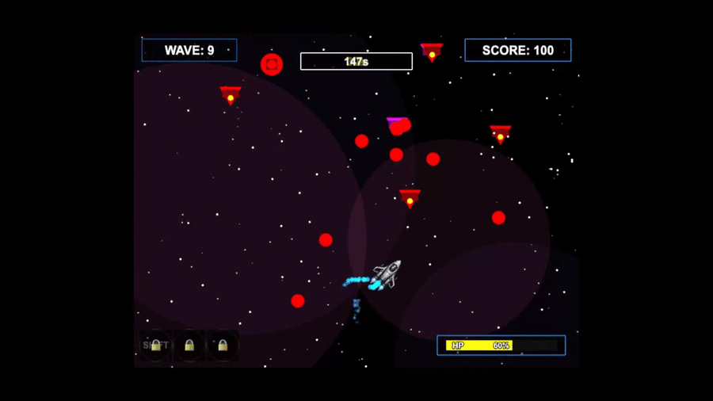
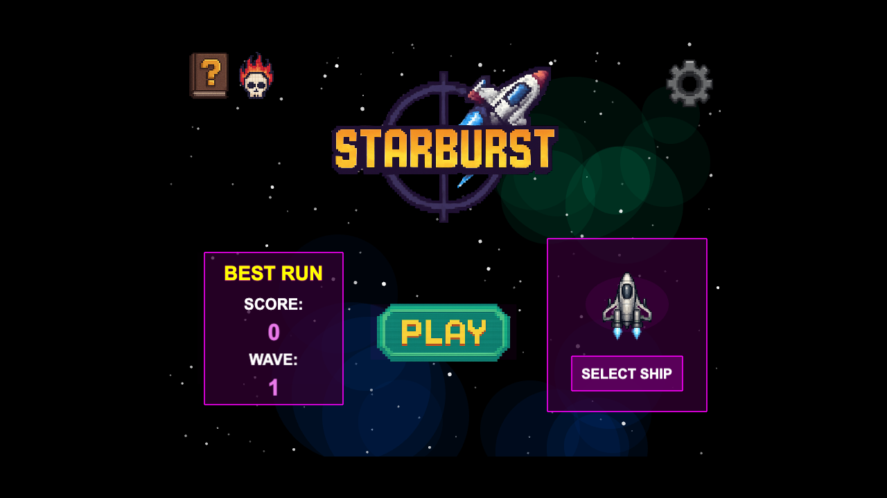
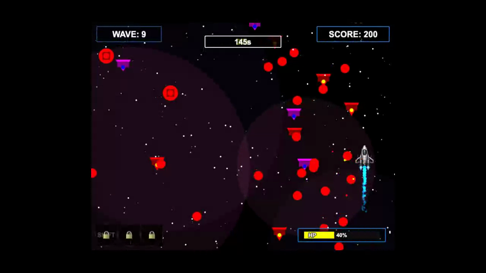

# StarBurst



Dodge bullet patterns, fight bosses, and build a stronger ship between waves.

**[▶ Play in browser](https://kpetrovski.me/play/starburst/)** · [itch.io](https://kirilp.itch.io/starburst)




## How to play

- **Arrow keys** move your ship.
- **Space** fires; press again for each shot.
- When unlocked, **Shift** dashes, **Z** activates a forcefield, and **X** activates phase shift.
- Survive timed waves and choose upgrades between them.

Created for **Bullet Hell Jam 6**. The gameplay capture stages an existing late-wave configuration, with normal enemy behavior and damage.

## Development

Built with JavaScript and Phaser 3.55.2. Serve the repository over HTTP:

```sh
python3 -m http.server 8000
```

Open `http://localhost:8000`. Phaser loads from jsDelivr, so the current build requires an internet connection. Game scenes live in `js/scenes/`; player, enemies, and wave logic live in `js/objects/`.
